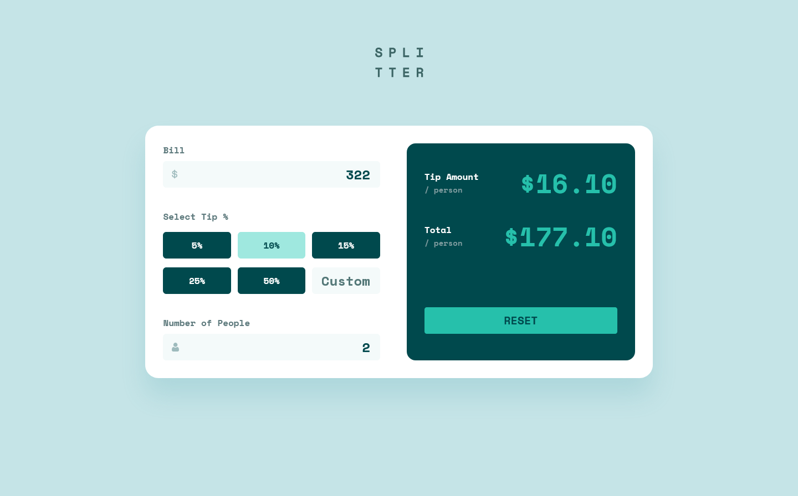

# Frontend Mentor - Tip calculator app solution

This is a solution to the
[Tip calculator app challenge on Frontend Mentor](https://www.frontendmentor.io/challenges/tip-calculator-app-ugJNGbJUX).
Frontend Mentor challenges help me improve my coding skills by building realistic projects.

## Table of contents

- [Overview](#overview)
  - [The challenge](#the-challenge)
  - [Screenshot](#screenshot)
  - [Links](#links)
- [My process](#my-process)
  - [Built with](#built-with)
  - [What I learned](#what-i-learned)
  - [Continued development](#continued-development)
- [Author](#author)

## Overview

### The challenge

Users should be able to:

- View the optimal layout for the app depending on their device's screen size
- See hover states for all interactive elements on the page
- Calculate the correct tip and total cost of the bill per person

### Screenshot

### Links

- Solution URL: [Solution](https://your-solution-url.com)
- Live Site URL: [Live Demo](https://tip-calculator-app-ivcenko.vercel.app/)

## My process

### Built with

- Semantic HTML5 markup
- CSS custom properties
- Flexbox
- CSS Grid
- Mobile-first workflow
- [React](https://react.dev/) - JS library
- [Vite](https://vitejs.dev/) - Frontend Tooling
- [Tailwindcss](https://tailwindcss.com/) - A utility-first CSS framework
- [Vitest](https://vitest.dev/) - Testing Framework

### What I learned

I learned how to set up and write basic unit tests for individual functions using Vitest.

### Continued development

In future projects, I want to focus on improving my skills in the Unit Testing.

- Strengthen the ability to isolate and test small units of code for better coverage
- Explore various test cases and edge scenarios to ensure thorough validation of individual
  components.

## Author

- Website - [Sergejs](https://sergejs-ivcenko.netlify.app)
- Frontend Mentor - [@Sergio0831](https://www.frontendmentor.io/profile/Sergio0831)
